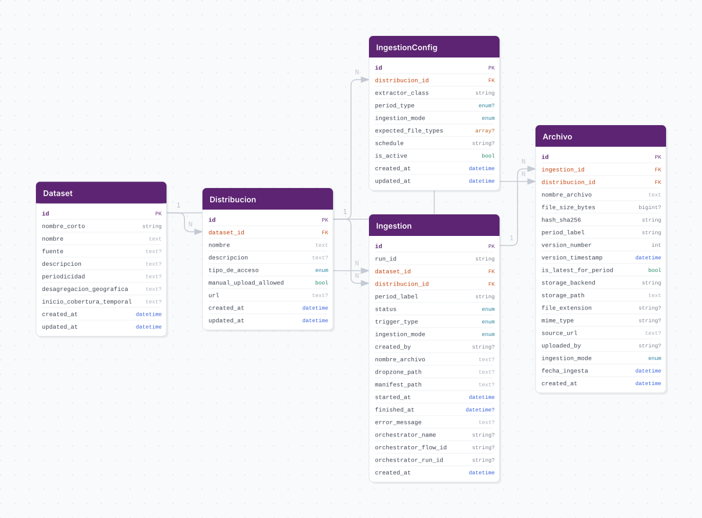

# Esquema de Base de Datos (Beta)

## Esquema

## Tablas

### datasets

| Columna | Tipo | Descripción |
|---------|------|-------------|
| id | integer | Primary key |
| nombre_corto | varchar(100) | Nombre único del dataset (product_key) |
| nombre | text | Nombre completo |
| fuente | text | Fuente de los datos |
| descripcion | text | Descripción opcional |
| periodicidad | text | Frecuencia de actualización |
| desagregacion_geografica | text | Nivel geográfico |
| inicio_cobertura_temporal | text | Inicio de datos históricos |
| is_active | boolean | Si el dataset está activo |
| created_at | datetime | Fecha de creación |
| updated_at | datetime | Última modificación |

### ingestions

| Columna | Tipo | Descripción |
|---------|------|-------------|
| id | integer | Primary key |
| run_id | varchar(100) | ID único de ejecución |
| dataset_id | integer | FK → datasets.id |
| status | enum | RUNNING, SUCCESS, FAILED, DUPLICATED |
| trigger_type | enum | SCHEDULED, MANUAL_CLI, etc. |
| ingestion_mode | enum | MANUAL, AUTOMATED, HYBRID |
| created_by | varchar(100) | Usuario que inició |
| started_at | datetime | Inicio de ejecución |
| finished_at | datetime | Fin de ejecución |
| error_message | text | Mensaje de error |
| notes | text | Notas adicionales |
| orchestrator_name | varchar(100) | Nombre del orquestador |
| orchestrator_flow_id | varchar(100) | ID del flow/DAG |
| orchestrator_run_id | varchar(100) | ID de la ejecución |
| created_at | datetime | Fecha de creación |

### archivos

| Columna | Tipo | Descripción |
|---------|------|-------------|
| id | integer | Primary key |
| ingestion_id | integer | FK → ingestions.id |
| nombre_archivo | text | Nombre del archivo |
| file_size_bytes | bigint | Tamaño en bytes |
| hash_sha256 | varchar(64) | Hash SHA256 |
| period_label | varchar(50) | Etiqueta del periodo (opcional) |
| storage_path | text | Ruta en el storage |
| file_extension | varchar(20) | Extensión del archivo |
| mime_type | varchar(100) | Tipo MIME |
| source_url | text | URL de origen |
| uploaded_by | varchar(100) | Usuario que subió |
| ingestion_mode | enum | MANUAL, AUTOMATED, HYBRID |
| fecha_ingesta | datetime | Fecha de ingesta |
| created_at | datetime | Fecha de creación |

## Relaciones

- `datasets` → `ingestions` (1:N)
- `ingestions` → `archivos` (1:N)

## Índices

### datasets
- `nombre_corto` (UNIQUE)

### ingestions
- `run_id` (UNIQUE)
- `idx_ingestions_dataset_status` (dataset_id, status)
- `idx_ingestions_dataset_started` (dataset_id, started_at)

### archivos
- `idx_archivos_hash` (hash_sha256)
- `idx_archivos_ingestion` (ingestion_id)

## Nota sobre el Alcance Beta

> **Importante:** Este esquema representa el alcance mínimo viable para la primera beta de RawLake. Las siguientes funcionalidades quedan **fuera de esta iteración** y podrán agregarse en futuras versiones según necesidad:
>
> - **Distribuciones**: Modelado de múltiples formatos o accesos para un mismo dataset
> - **Ingestion Configs**: Configuración dinámica de extractores y schedules
> - **Recurso Datos**: Catalogación de entidades lógicas dentro de archivos (hojas de Excel, miembros de ZIP, etc.)
> - **Schema Registry**: Análisis y validación de estructuras de columnas y tipos
> - **Versionado por periodo**: Control de versiones y flags de "último válido" por periodo
>
> El modelo actual está diseñado para soportar el flujo básico de landing zone con auditoría, permitiendo que los ETLs del DWH consulten la última ejecución exitosa y obtengan la ruta de los archivos disponibles. La interpretación del contenido de los archivos sigue siendo responsabilidad de cada ETL específico.
